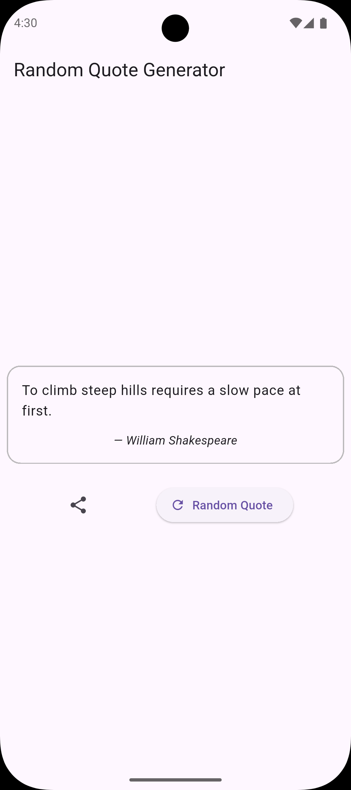

# Random Quote Generator (Flutter)

A simple Flutter app that fetches a large list of quotes from a public JSON
dataset and shows a random quote on demand. It includes basic loading/error
handling and sharing via the native share sheet.

**Quote source:** `dwyl/quotes` (`quotes.json`) served from GitHub raw.

## Screenshots

| Example 1                                | Example 2                              |
| ---------------------------------------- | -------------------------------------- |
|  |  |

## Features

- [x] Fetches quotes from GitHub-hosted JSON on first launch
- [x] “Random Quote” refresh button
- [x] Share current quote (via `share_plus`)
- [x] Loading + retry UI on network failure
- [x] Light theme + dark theme (follows system)

## Tech Stack

- Flutter + Material
- State: `provider` (`ChangeNotifier`)
- HTTP: `dio`
- Models: `json_serializable` / `json_annotation`
- Sharing: `share_plus`
- Dev: `device_preview` enabled in debug on non-web (and not Android)

## Project Structure

- `lib/main.dart` — app entry + `DevicePreview` wrapper
- `lib/quote_generator.dart` — `MaterialApp` + `ChangeNotifierProvider`
- `lib/controller/quote_provider.dart` — fetches dataset + picks random quote
- `lib/view/quote_screen.dart` — main UI + share action
- `lib/widgets/quote_view.dart` — quote card widget
- `lib/model/quote.dart` — `QuoteModel` (JSON serializable)

## Getting Started

### Prerequisites

- Flutter (Dart SDK constraint in `pubspec.yaml`: `^3.8.1`)

### Run

```bash
flutter pub get
flutter run
```

## Code Generation (JSON)

`QuoteModel` uses `json_serializable`. If you change `lib/model/quote.dart`,
regenerate `lib/model/quote.g.dart`:

```bash
dart run build_runner build --delete-conflicting-outputs
```

Watch mode (matches `.vscode/tasks.json`):

```bash
dart run build_runner watch --delete-conflicting-outputs
```

## Roadmap

- [ ] Favorites (in-memory and/or persistent storage)
- [ ] Filter/search by author/tags
- [ ] Offline caching of the quote dataset

<!-- ## Web Build / GitHub Pages

This repo includes a prebuilt web output in `docs/` (commonly used for GitHub
Pages). To rebuild it:

```bash
flutter build web --release --output docs --base-href /random_quote_generator/
```

If your Pages site is hosted under a different path, adjust `--base-href`
accordingly. -->
